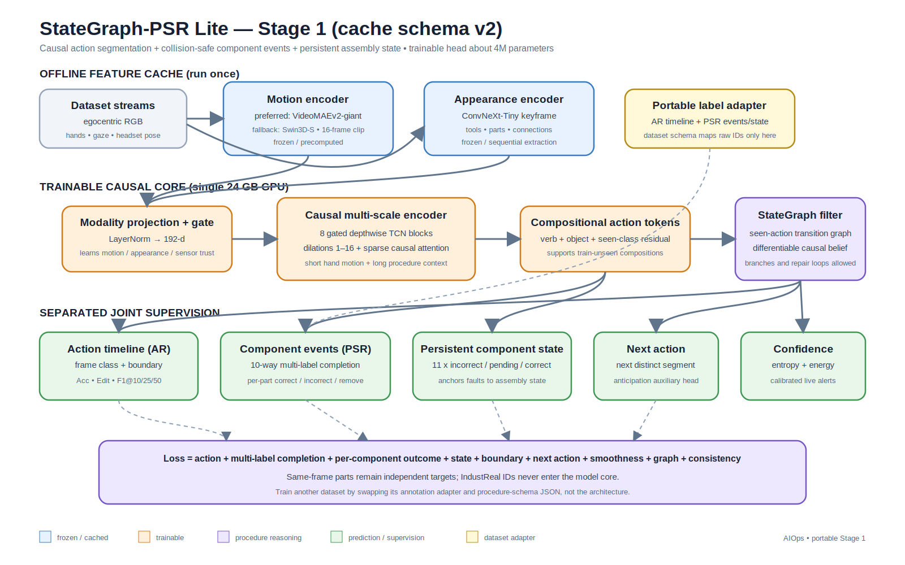

# StateGraph-PSR Lite: Stage-1 implementation

## What was implemented

StateGraph-PSR Lite is a causal, multi-task temporal model for IndustReal procedure-step recognition. It is designed to improve the group's two baselines without placing two giant video encoders in the training graph. Visual representations are extracted once and cached; training then fits a compact temporal/state model on one 24 GB GPU.



This repository now contains:

- `src/aiops/features/industreal_cache.py`: official IndustReal discovery, frozen feature extraction, sensor alignment, dense-label construction, and compressed per-recording caches.
- `src/aiops/models/stategraph_psr.py`: modality-gated causal temporal encoder, action prototypes, differentiable procedure graph, six prediction/diagnostic outputs, and the joint loss.
- `src/aiops/training/train_stategraph_psr.py`: recording-level splits, balanced losses, mixed precision, gradient accumulation, early stopping, checkpoint selection, and temporal/fault metrics.
- `src/aiops/data/industreal.py`: tolerant readers for PSR completion events, raw component states, gaze, hands, and pose.
- `src/aiops/data/stategraph_cache.py`: cache format, windowing, padding, and sparse transition-graph estimation.
- `src/aiops/evaluation/temporal_metrics.py`: frame accuracy support plus normalized Edit and segmental F1@10/25/50.
- `configs/stategraph_psr_stage1.json`: the recommended starting configuration.

No result is claimed yet: the code has been structurally and data-adapter tested, but it has not been trained on the user's full labeled IndustReal release in this workspace.

## Why this is stronger than the compared architectures

The SSv2-giant + DiffAct result has strong segmentation boundaries but cannot identify incorrect installation. The dual-backbone ASFormer result introduces appearance information and obtains non-zero incorrect recall, but the fault signal is fragile and the trainable temporal representation does not explicitly model assembly state. StateGraph-PSR Lite combines their useful ideas and adds three missing inductive biases:

1. **Motion and appearance are complementary.** Cached VideoMAEv2 features represent hand/object dynamics; a lightweight center-frame ConvNeXt feature emphasizes tools, parts, and connection state. Hands, gaze, and headset pose are a third modality. A learned gate changes their importance at every time step and supports missing sensors.
2. **Local motion and long procedure context are both causal.** Gated depthwise temporal convolutions cover multiple time scales. Sparse causal self-attention supplies long context without the memory cost of full attention at every block. The model never sees future frames, so offline evaluation matches the future live-feed constraint.
3. **A mistake is a state inconsistency, not merely an action label.** The network jointly predicts step, four-way outcome, eleven component states, boundary, and next step. A consistency loss links `incorrect` outcome probability to the probability that any component is in an incorrect state.
4. **Procedure knowledge participates in learning.** A sparse graph is estimated only from training recordings. Its differentiable causal belief filter biases the step posterior toward legal transitions while retaining the ability for visual evidence to override the graph. Unlike a hard Viterbi-only decoder, it permits branches and repair loops.
5. **Action prototypes stabilize scarce classes.** One learned token per step lets every time feature attend to a class prototype, following the feature-alignment motivation behind FACT. Class-balanced focal losses further reduce domination by correct/common frames.

## Architecture and tensors

At each sampled time index, the cache stores:

| Tensor | Recommended source | Shape |
|---|---|---|
| motion | cached SSv2 VideoMAEv2-giant; Swin3D-S fallback | `T × 1408` or `T × 768` |
| appearance | frozen ConvNeXt-Tiny keyframe | `T × 768` |
| sensor | hands + gaze + headset pose | `T × 128` |
| modality mask | available motion/appearance/sensor flags | `T × 3` |
| step/outcome/boundary | dense labels from PSR completion events | `T`, `T`, `T` |
| state/state mask | carried-forward PSR raw state | `T × 11` |

Each modality is projected to 192 dimensions. The gated sum enters eight causal temporal blocks with dilation cycle `1, 2, 4, 8, 16`; every second block includes causal multi-head attention. Action-prototype attention refines the feature. Raw step logits are recursively combined with the transition prior to produce the graph-aware posterior. The default head is approximately four million trainable parameters; exact size is printed in `summary.json` because input dimensions and class count affect it.

The objective is:

`L = Lstep + 0.7 Loutcome + 0.8 Lstate + 0.25 Lboundary + 0.3 Lnext + 0.12 Lsmooth + 0.15 Lgraph + 0.15 Lconsistency`

Step and outcome use class-balanced focal cross-entropy. State uses masked cross-entropy. Boundary uses dynamically weighted BCE. The graph term penalizes posterior mass on unseen training transitions, and smoothing reduces frame-level oscillation. Labels equal to `-100` are ignored by losses and temporal metrics.

Because incorrect events are rare, training also uses a weighted window sampler:
windows containing an incorrect outcome or any supervised incorrect component
state receive a default 4× sampling weight. Validation and test windows remain
unweighted. The trainer reports the number of rare windows in `summary.json`.

## Expected IndustReal layout

The cache builder supports the official extracted structure, including a possible single outer archive folder:

```text
INDUSTREAL_ROOT/
  recordings/
    train|val|test/
      RECORDING_ID/
        rgb/*.jpg
        PSR_labels_with_errors.csv
        PSR_labels_raw.csv       # optional but strongly recommended
        hands.csv                # optional
        gaze.csv                 # optional
      pose.csv                 # optional
```

It also supports the layout verified on the GPU desktop, where annotations are
in that split tree but RGB videos are stored at the dataset root:

```text
INDUSTREAL_ROOT/
  RECORDING_ID.mp4
  recordings/
    train|val/
      RECORDING_ID/
        PSR_labels_with_errors.csv
        PSR_labels_raw.csv
```

Official headerless PSR CSV rows (`frame, step_id, description`) and headered
exports are both recognized. Video frame indices are used directly for label
alignment.

Audit before extraction or training:

```bash
python -m aiops.data.industreal --data-root "D:/IndustReal"
```

The dataset currently visible under this repository is a custom bundle of large HoloLens MP4 files, not the official frame/PSR annotation tree. Those videos alone cannot supervise the step, error, or component-state heads. Point `--data-root` to the fully extracted labeled release, or export verified temporal labels from the repository's Hand Atlas labeler before training.

## Installation and cache creation

Use the CUDA wheel appropriate to the desktop first, then install the repository:

```bash
python -m pip install torch torchvision --index-url https://download.pytorch.org/whl/cu124
python -m pip install -e ".[dev,vision]"
```

Low-risk fallback cache (both encoders included here):

```bash
python -m aiops.features.industreal_cache \
  --data-root "D:/IndustReal" \
  --output-dir "D:/IndustReal_cache/stategraph_swin_convnext" \
  --device cuda --mixed-precision bf16
```

Recommended cache when the group's 1408-dimensional VideoMAEv2 features already exist as `RECORDING_ID.npy` or `.npz`:

```bash
python -m aiops.features.industreal_cache \
  --data-root "D:/IndustReal" \
  --output-dir "D:/IndustReal_cache/stategraph_vmae_convnext" \
  --motion-features-dir "D:/features/videomaev2_giant_ssv2" \
  --device cuda --mixed-precision bf16
```

Feature files must be `[time, feature_dim]`. If their temporal length differs, the adapter resamples them to cache centers. For rigorous comparison, verify timestamps rather than relying on this fallback resampling.

## Training

```bash
python -m aiops.training.train_stategraph_psr \
  --cache-index "D:/IndustReal_cache/stategraph_vmae_convnext/index.json" \
  --output-dir runs/stategraph_psr_v1 \
  --precision bf16 --batch-size 2 --accumulation-steps 8 \
  --sequence-length 256 --sequence-stride 192 \
  --epochs 80 --patience 15
```

The script writes `history.jsonl`, `best_checkpoint.pt`, and `summary.json`. Validation selection uses `F1@50 + 0.25 Edit + 0.25 incorrect-F1`; recall alone is not used because predicting every frame as incorrect can otherwise win checkpoint selection. Test evaluation is deliberately disabled during model selection. After all choices are frozen, run once with `--evaluate-test`.

For lower memory, reduce sequence length to 160, then batch size to 1 and increase accumulation. For more compute, retain cached encoders first and compare hidden dimension 256, 12 temporal blocks, and an InternVideo2/VideoMAE appearance cache. Fine-tuning the giant backbone should be a later controlled experiment with LoRA or the final blocks only.

## Evaluation and ablation plan

Use official recording-level splits; never split windows from the same recording across train and validation. Report:

- frame accuracy, normalized Edit, F1@10/25/50;
- incorrect-install precision, recall, F1, and area under precision-recall—not recall alone;
- remove precision/recall/F1;
- macro component-state F1 and per-component confusion matrices;
- online detection delay from first faulty evidence to alert;
- expected calibration error and false alerts per minute.

Run ablations in this order so the source of gains is explainable:

| Experiment | Motion | Appearance | Sensors | Graph/state losses | Purpose |
|---|---:|---:|---:|---:|---|
| A | VideoMAEv2 | – | – | – | reproduce motion-only reference |
| B | VideoMAEv2 | ConvNeXt | – | – | isolate appearance/fault benefit |
| C | VideoMAEv2 | ConvNeXt | hands/gaze/pose | – | quantify egocentric sensor gain |
| D | VideoMAEv2 | ConvNeXt | sensors | graph only | transition prior gain |
| E | VideoMAEv2 | ConvNeXt | sensors | graph + component state | complete model |

Use at least three seeds for B–E and bootstrap confidence intervals by recording. Because incorrect-install frames are scarce, compare paired recording-level predictions and inspect every false negative. Do not conclude that a larger encoder is better from frame accuracy alone.

## Path toward mistake type and recommendation

Stage 1 intentionally exposes representations required by later stages:

- **Mistake type:** combine predicted step, outcome, component-state delta, detected tool/object, and graph edge in a hierarchical fault head (`wrong tool`, `wrong part`, `wrong connection`, `wrong order`, `omission`, `removal`).
- **Future state:** roll the learned state graph forward from the current component-state belief and train a horizon-conditioned next-state decoder.
- **Recovery:** search the procedure/recovery graph for the lowest-cost sequence from current belief to a valid state. A VLM may explain the selected recovery in natural language, but the graph supplies the safety-constrained recommendation and evidence.

The Stage-1 checkpoint should therefore be selected on both segmentation and error/state performance, not only F1@50.

## Research basis

- Ragusa et al., [The IndustReal Dataset for Procedure Step Recognition Handling Execution Errors in Egocentric Videos](https://arxiv.org/abs/2312.10390), ECCV 2024.
- Ragusa et al., [STORM: Spatio-Temporal Context for Procedure Step Recognition in Surgical Videos](https://arxiv.org/abs/2407.18872), 2024. The project plan adapts its state/context emphasis to industrial assembly.
- Lu and Elhamifar, [FACT: Frame-Action Cross-Attention Temporal Modeling for Efficient Action Segmentation](https://arxiv.org/abs/2403.11929), CVPR 2024.
- Ding et al., [DiffAct: Diffusion Temporal Action Segmentation](https://arxiv.org/abs/2303.17959), 2023.
- Yi et al., [ASFormer: Transformer for Action Segmentation](https://arxiv.org/abs/2110.08568), BMVC 2021.
- Wang et al., [VideoMAE V2: Scaling Video Masked Autoencoders with Dual Masking](https://arxiv.org/abs/2303.16727), CVPR 2023.
- Grauman et al., [Ego-Exo4D: Understanding Skilled Human Activity from First- and Third-Person Perspectives](https://arxiv.org/abs/2311.18259), CVPR 2024, supporting multimodal skilled-activity representations and future reasoning.

These works motivate the encoders and temporal/prototype mechanisms; the modality gate, component-state consistency objective, and differentiable IndustReal transition filter are the project-specific synthesis implemented here.
